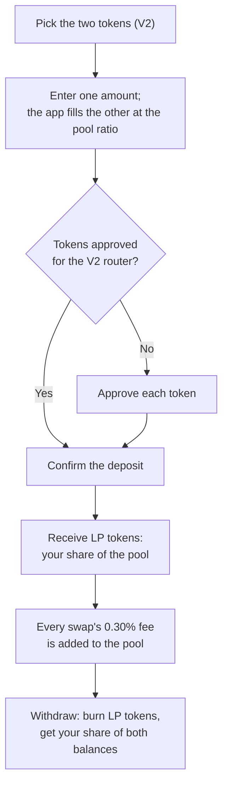
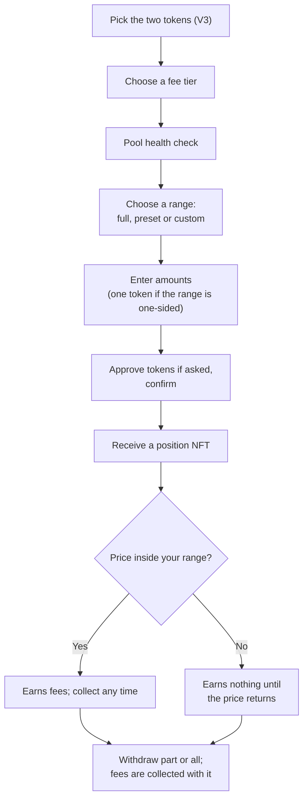

# Add liquidity

When you add liquidity, you deposit two tokens into a pool. Traders swap against what you deposited, and you earn a share of the fee on every swap, in proportion to your share of the pool.

AchSwap has two kinds of pool. Which one to use depends on how hands-on you want to be.

| | V2 | V3 |
| --- | --- | --- |
| Price range | Every price | A range you choose |
| Fee | 0.30%, always | 0.01%, 0.05%, 0.30%, 1% or 10% |
| You receive | LP tokens | An NFT for your position |
| Upkeep | None | Check whether the price is still in your range |

[V2 versus V3](/achswap/v2-vs-v3) compares them in more depth.

## Before you start

- Open the pool's page from the Liquidity list and check its [TVL, volume and price](/achswap/pools#before-adding-liquidity).
- Make sure both token addresses are the ones you mean to use.
- Keep some USDC for gas. If one of your tokens is USDC, **MAX** leaves 0.05 USDC behind for fees.

## V2: deposit both tokens

1. On the **Liquidity** page, choose **V2**, then pick the two tokens.
2. Enter an amount for one token. The app fills in the other at the pool's current ratio.
3. Approve each token if your wallet asks.
4. Confirm the deposit. You receive LP tokens for your share of the pool.

Your share earns 0.30% of every swap through the pool. The fees are added to the pool itself, so your LP tokens are worth more over time. You collect them when you withdraw.

**Creating a new V2 pool.** If the pair has no pool yet, you'll be the first depositor, and the ratio you deposit becomes the starting price. Match the market price. Deposit 1 EURC and 1 USDC, for example, while EURC trades at 1.12 USDC, and arbitrage traders will buy your EURC cheaply the moment the pool exists.

## V3: choose a price range

A V3 position only earns fees while the price is inside the range you choose. A narrower range earns more per dollar while the price stays inside it, and nothing once it leaves.

1. On the **Liquidity** page, choose **V3**, then pick the two tokens.
2. **Pick a fee tier.**
   - 0.01%: very stable pairs.
   - 0.05%: stable pairs.
   - 0.30%: most pairs.
   - 1%: volatile or exotic pairs.
   - 10%: very exotic pairs.

   Go where the trading volume is: the same pair can have a pool at each tier, and a pool nobody trades through earns nothing.
3. **Pick a range.**
   - **Full range** covers every price. It never goes out of range and behaves like V2.
   - **Custom** lets you set a minimum and maximum price, or start from a preset:

   | Preset | Range |
   | --- | --- |
   | Stable | ±10% around the current price |
   | Wide | ±50% around the current price |
   | One side lower | Entirely below the current price |
   | One side upper | Entirely above the current price |
   | At tick | The narrowest possible range. It leaves range on the next price move. |

4. **Enter amounts.** For a range around the current price, you deposit both tokens and the app works out the ratio. For a range entirely above or below the price, you deposit only one token.
5. **Check the summary**: the range, your amounts and the **Est. APR**, which is based on the pool's last 7 days of fees. It assumes the price stays in your range and is not a promise.
6. Approve the tokens if asked, then confirm. You receive an NFT that represents your position.

### What happens as the price moves

Take a EURC/USDC position with a range of 1.10 to 1.15 USDC per EURC. Below 1.10 it holds only EURC; between 1.10 and 1.15 it holds both and earns fees; above 1.15 it holds only USDC. [Concentrated liquidity](/achswap/concentrated-liquidity#what-the-position-holds-as-the-price-moves) shows this as a diagram.

- **Inside the range**, your position holds both tokens and earns fees. As the price moves, it slowly sells the rising token for the falling one.
- **Outside the range**, it holds only one token and earns nothing until the price comes back.

To change a range, withdraw the position and open a new one. See [concentrated liquidity](/achswap/concentrated-liquidity).

### One-sided deposits

A range entirely above the current price holds only the base token; one entirely below it holds only the quote token. This works like a limit order that fills as the price passes through your range. Enter the one token the app asks for. It won't let you add the other.

### Pool health checks

When you pick a V3 pair, the app checks the pool before you deposit:

| Check | What it means |
| --- | --- |
| **Healthy** | The pool has a sensible price. Go ahead. |
| **Not initialized** | The pool exists but has no starting price. Enter amounts for both tokens and use **Initialize**: your ratio sets the price. |
| **Price mismatch** | The pool's price is far from the market price, more than 50 times off. Depositing at this price would lose value to arbitrage. |
| **Extreme price** | The pool's price is broken, near the limit of what V3 allows. The app shows step-by-step instructions to repair it with a tiny position and a swap. |
| **No active liquidity** | Nobody's range covers the current price. You can still add: a full-range position covers it. |

## Moving a V2 position to V3

The Liquidity page also has a **Migrate** flow. It withdraws your V2 position and deposits it into a V3 position in one go. Pick the fee tier and range as you would for a new position. If the price ratio means not all of your tokens fit in the range, the rest is returned to your wallet.

A V3 position has different risks from a V2 one. Choose the range with the same care as a new deposit.

## Risks to understand

- **Price movement.** If one token falls against the other, your position ends up holding more of the falling token. This is often called impermanent loss. Fees can make up for it, or not.
- **Out of range.** A V3 position outside its range earns nothing.
- **No guaranteed return.** APR figures look back at past fees. Future volume can be higher or lower. See [liquidity earnings and risks](/achswap/liquidity-earnings).
- **Token risk.** Liquidity paired with a token that loses its value loses value with it.

When you're done, see [remove liquidity](/achswap/remove-liquidity).
