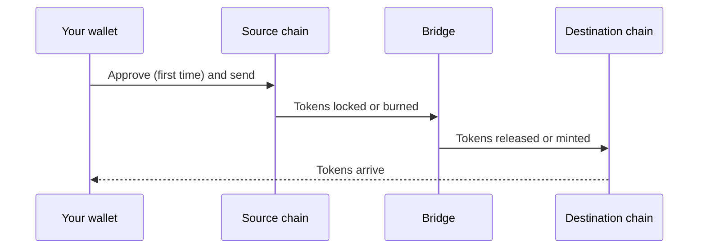

# Bridge

The **Bridge** page moves tokens between chains: onto Arc, off Arc, or between two other chains. It runs on [LI.FI](https://li.fi), which compares bridges and DEXs and finds a route for the exact transfer you ask for.

## How to bridge

1. Open **Bridge** and connect your wallet.
2. Pick the **source** chain and token, then the **destination** chain and token.
3. Enter an amount. LI.FI shows the best route it found, with the amount you'll receive, the fees and an estimated time.
4. Open the route to compare alternatives if you like: faster routes can cost more.
5. Confirm. Depending on the route, your wallet may ask for an approval first, then the transfer itself.
6. Keep the page open until the transfer completes. The widget follows it across both chains.

Most transfers take between a few seconds and a few minutes. The estimate in the widget is the bridge's own; congestion on either chain can make it longer.

## Chains and wallets

The Bridge supports Arc plus about two dozen other chains, including Ethereum, Base, Arbitrum, BNB Chain, Polygon and Solana. The list in the widget is the current one.

- **EVM chains** use your connected EVM wallet. The widget asks your wallet to switch chains when it needs to.
- **Solana** needs a Solana wallet such as Phantom, Backpack or Solflare. The app asks you to connect one when Solana is the source or destination.

## Bridging USDC from Arc

On Arc, USDC pays the network fee from the same balance you're bridging. When you bridge USDC out of Arc, the page always leaves **0.05 USDC** in your wallet so the transaction can pay for itself. MAX already takes this into account.

## Getting gas on the destination

If you're bridging to a chain where you hold none of its gas token, look for the gas refuel option in the route settings. It converts a small part of your transfer into the destination's gas token, so you can make a transaction when your funds arrive.

## Fees

You pay:

- the bridge's and any DEX's own fees, shown in the route;
- gas on the source chain, and on the destination if the route needs a transaction there;
- AchSwap's fee of **0.50%** on bridge transfers.

The amount you're shown as receiving already has these taken off. See [fees](/technical/fee-structure#lifi).

## Before you confirm

- **Check the destination chain and address.** Tokens sent to the wrong chain or address may not be recoverable.
- **Check the token you'll receive.** The same name can be a different token on another chain, or a bridged version.
- **Look at the minimum received**, not only the estimate.

## If a transfer seems stuck

- Leave the page open, and check the transfer status in the widget's history.
- Check your balance on the destination chain before trying again. LI.FI sometimes reports a Solana timeout even though the transfer went through, and retrying would send the funds twice.
- A failed bridge transfer is usually refunded on the source chain, sometimes as a different token than you sent. Refunds can take a while.
- If you need help, contact [support@achswap.app](mailto:support@achswap.app) with the source transaction hash.

## Smart-contract wallets

If your wallet is a smart contract, or an EIP-7702 upgraded wallet, the Bridge asks for approval transactions instead of signatures. Some of these wallets reject valid signatures; an approval transaction works with all of them.

Bridges also earn XP: see [how to earn XP](/quests/earning-xp).
