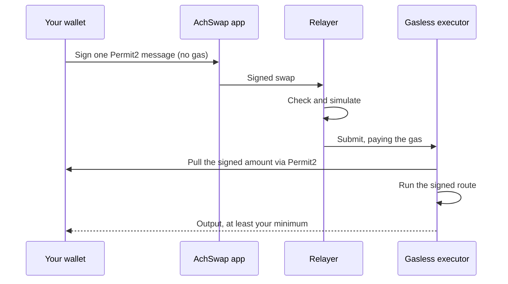

# Gasless swaps

With gasless mode on, you sign a swap instead of sending a transaction. An AchSwap relayer submits it on Arc Mainnet and pays the network gas. The tokens come from your wallet and the output goes back to it. The relayer cannot change the trade you signed.

## What you can swap

- **Pay with:** USDC, EURC or cirBTC.
- **Receive:** any token you can route to, including USDC.
- **Routes:** KyberSwap, LI.FI and AchSwap's own routes, including split and multi-hop routes from AchSwap's router. If the best quote uses another route, gasless mode is not available for that swap.
- **Minimum size:** each input token has a minimum USD value, set by AchSwap and applied on the swap screen. Smaller amounts and exact-output quotes go through a normal swap, where you pay the gas.
- **Recipient:** always your connected wallet. Gasless mode does not support a custom recipient.

## How a gasless swap works

1. **One-time approval.** The first time you use a token gaslessly, your wallet asks you to approve it for Permit2 (`0x000000000022D473030F116dDEE9F6B43aC78BA3`). You pay gas for this once per token. The swap continues automatically once it confirms.
2. **One signature.** Your wallet shows a Permit2 message. It names the token and amount you pay, with the AchSwap gasless executor as spender. It also contains the swap itself: the contract that executes it, the token you receive, the minimum you accept, your address as recipient, and a hash of the exact route. Signing costs no gas.
3. **Relay.** AchSwap's relayer checks the request, simulates it and submits it. You see the transaction hash as soon as it is broadcast.
4. **Settlement.** On chain, the executor pulls exactly the signed amount through Permit2 and runs the signed route. It then checks that your wallet received at least the minimum. If not, the whole transaction reverts and nothing leaves your wallet.

When a swap will be gasless, a small **Gasless** label appears next to the exchange rate. **Network cost** in the trade details then shows the normal cost struck through, marked "Free · Gasless". The confirmation's **Show more** lists the normal network cost, your saving, and **$0.00** as what you pay.

## Fees

Gasless mode adds no fee of its own. The route's normal fees still apply, as on a regular swap: AchSwap's 0.25% on AchSwap routes, or the LI.FI and KyberSwap integrator fees, plus pool fees. See [fees](/technical/fee-structure).

## Cancelling and expiry

A signed swap is valid only until the deadline in your swap settings, and the relayer refuses deadlines more than three hours ahead. Each signature has a one-time Permit2 nonce, so it can execute at most once. To cancel a signature that has not executed yet, let it expire, or invalidate its nonce with Permit2's `invalidateUnorderedNonces`.

## If a gasless swap fails

- **Signature rejected or expired:** sign again. Nothing was spent.
- **Price moved:** the output would be below your minimum, so the transaction reverts. Refresh the quote and try again, or raise slippage.
- **Below the minimum, or an unsupported route:** turn gasless mode off and swap normally.

Technical details, including exactly what your signature authorizes, are in [gasless architecture](/technical/gasless#what-your-signature-authorizes). The trust model is summarised under [security](/technical/security#gasless-authorization). Gasless swaps are an app feature; the [Developer API](/developers/developer-api) doesn't offer them. If something goes wrong, see [troubleshooting](/help/troubleshooting#why-did-a-gasless-swap-fail).
