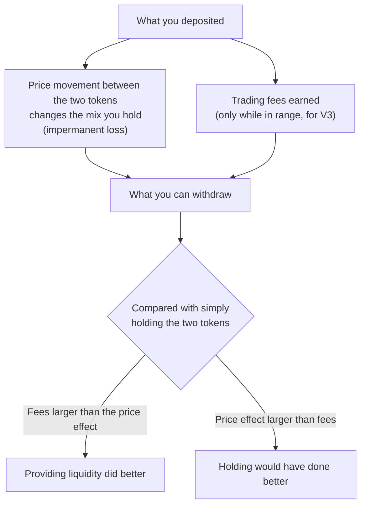

# Liquidity earnings and risks

Providing liquidity earns trading fees, but your result also depends on how the two tokens' prices move. This page explains both sides, so you can judge a position before you open it. For the steps, see [add liquidity](/achswap/add-liquidity).

## What a position is worth

**Fees** come from swaps through the pool. Each swap pays the pool's fee tier (for example 0.30%), shared among the liquidity in use at that price, in proportion to each provider's share. More volume means more fees; no volume means none.

**Price movement** changes what you hold. As one token rises against the other, the pool sells some of the rising token for the falling one, so you end up with more of the token that fell. Compared with holding the tokens in your wallet, that is a loss, often called **impermanent loss**: it shrinks if the price returns, and becomes permanent when you withdraw at the new price.

For a V2 or full-range position, the effect depends only on how far the price ratio moved, whichever direction:

| Price of one token against the other | Value compared with holding |
| --- | --- |
| Unchanged | 0% |
| ×1.25 or ÷1.25 | −0.6% |
| ×1.5 or ÷1.5 | −2.0% |
| ×2 or ÷2 | −5.7% |
| ×4 or ÷4 | −20.0% |

These follow from the constant-product formula, before fees. A V3 position with a narrow range is affected more strongly by the same price move than a full-range one, because the same tokens provide more liquidity over a shorter stretch of price.

## V3: range matters

A V3 position only earns while the price is inside its range. Outside it, the position holds one token only and earns nothing.

| Range | Fees while in range | Chance of leaving the range | Price-movement effect |
| --- | --- | --- | --- |
| Full range | Lowest per dollar | Never leaves | Like V2 |
| Wide (±50%) | Moderate | Only on large moves | Moderate |
| Narrow (±10% or less) | Highest per dollar | High in volatile markets | Strongest |

A narrow range on a stable pair such as USDC/EURC can make sense; the same range on a volatile pair may spend most of its time out of range. See [concentrated liquidity](/achswap/concentrated-liquidity).

## Reading APR figures

AchSwap shows two kinds of APR, both **historical**:

| Where | What it is |
| --- | --- |
| **Est. APR** when adding V3 liquidity | The pool's last 7 days of fees, annualised, for liquidity in range. |
| **Fee APR** on a pool page (not live yet) | The pool's last 24 hours of fees, annualised, over its current TVL. |

Neither is a forecast. Both:

- **look backwards.** Next week's volume can be higher or lower. One busy day can make a 24-hour figure look high.
- **leave out price movement.** A pool can show a high fee APR while its providers lose value to price moves.
- **assume your liquidity is in range**, for V3.
- **change as liquidity arrives.** More liquidity in a pool splits the same fees among more providers.

No APR shown by AchSwap is a promise of income. Providing liquidity can lose money.

## Risks in low-liquidity and volatile pools

- **Thin pools** earn little when volume is low, and their price can be pushed far from the market by one trade. Arbitrage traders then bring it back, at the providers' expense.
- **Volatile tokens** move the price ratio more, which means larger price-movement effects and more time out of range for V3.
- **Token risk.** If a token loses its value, liquidity paired with it loses value too. A token can also be paused or blocked by its issuer.
- **New pools.** The first deposit sets the price. A wrong starting price is corrected by arbitrage at the first depositor's expense. See [pool health checks](/achswap/add-liquidity#pool-health-checks).

## Which figures are live, historical or estimated

| Figure | Kind |
| --- | --- |
| Pool balances, current price, TVL, depth | Live: from the pool's current on-chain state |
| 24H volume and fees, Fee APR, price history | Historical: from past swaps |
| Est. APR when adding liquidity | Historical, last 7 days |
| Cost by trade size | Live calculation on the current state |

The pool pages that will show these figures are described in [pools](/achswap/pools); they are built but not live yet.
