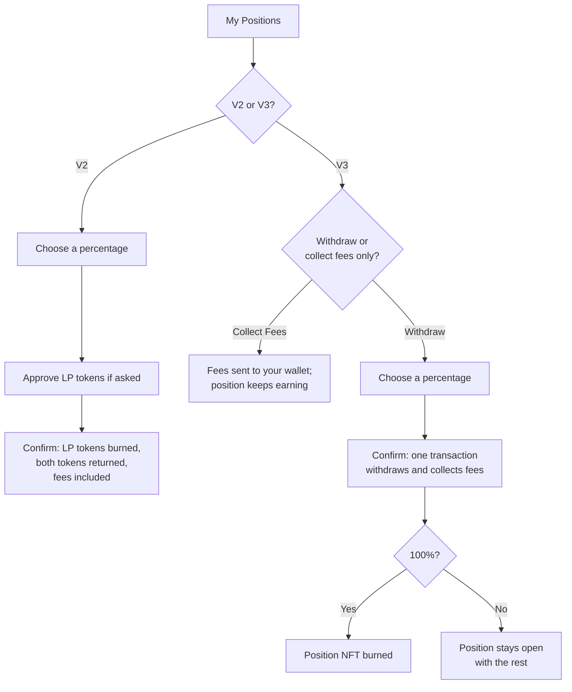

# Remove liquidity

You can withdraw some or all of a position at any time. There is no lock-up and no withdrawal fee beyond gas.

## Find your positions

On the **Liquidity** page, open **My Positions** with the wallet that owns them connected. The app finds your V2 and V3 positions automatically. A V3 position shows whether the price is currently **In range** (earning fees) or **Out of range**.

If a position is missing:

- **V3:** use **Import Position by Token ID** and enter the position's NFT token ID. You can find it in the transaction that created the position, on the explorer.
- **V2:** use **Import Pool** and pick the token pair.

Imported positions are remembered in this browser.

## Withdraw from V2

1. Pick the position and choose how much to withdraw, up to 100%.
2. Check the two token amounts you'll receive.
3. Approve your LP tokens if asked, then confirm.

You get back your share of the pool's current balances. Fees you earned are already included, because V2 adds them to the pool. The amounts can differ from what you deposited: if the price moved, you'll get back more of one token and less of the other.

## Withdraw from V3

1. Pick the position and choose a percentage.
2. Check the amounts, which include any fees the position has earned.
3. Confirm. One transaction withdraws the tokens and collects the fees.

At 100%, the same transaction also burns the position's NFT, since it's empty.

**Collecting fees only.** To take your earned fees without touching your liquidity, use **Collect Fees** on the position. Your range stays as it is and keeps earning.

**Changing a range.** A V3 range can't be edited. Withdraw the position, then [add a new one](/achswap/add-liquidity#v3-choose-a-price-range) with the range you want.

## What you get back

An out-of-range V3 position returns only one token: all of the base token if the price is below your range, all of the quote token if it's above. An in-range position returns both.

Withdrawn amounts always reflect the pool's state when the transaction runs. Each withdrawal sets a minimum for each token. If the price moves past it before your transaction is mined, the transaction reverts and nothing is withdrawn.

## If a withdrawal fails

| Cause | Fix |
| --- | --- |
| Price moved past the minimum | Refresh the page and try again. |
| Deadline passed | Confirm promptly after opening the wallet prompt, or try again. |
| LP token not approved (V2) | Approve it when asked, then withdraw. |
| Not enough USDC for gas | Add a little USDC to your wallet. |
