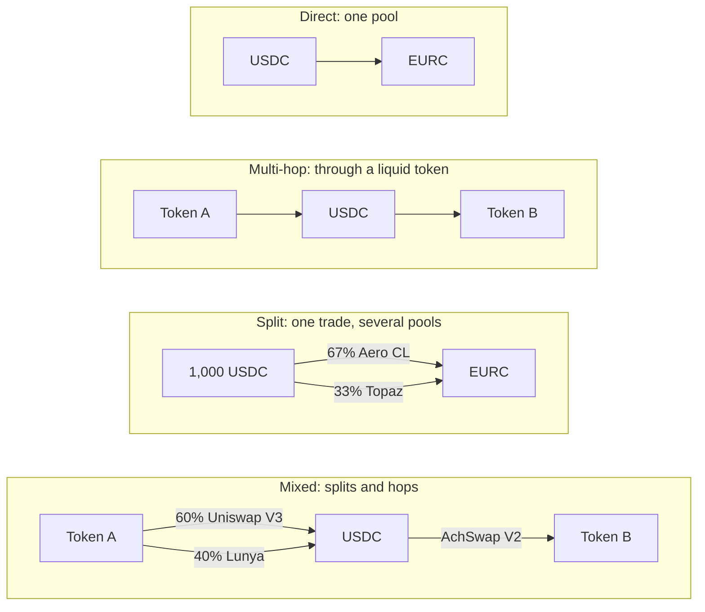
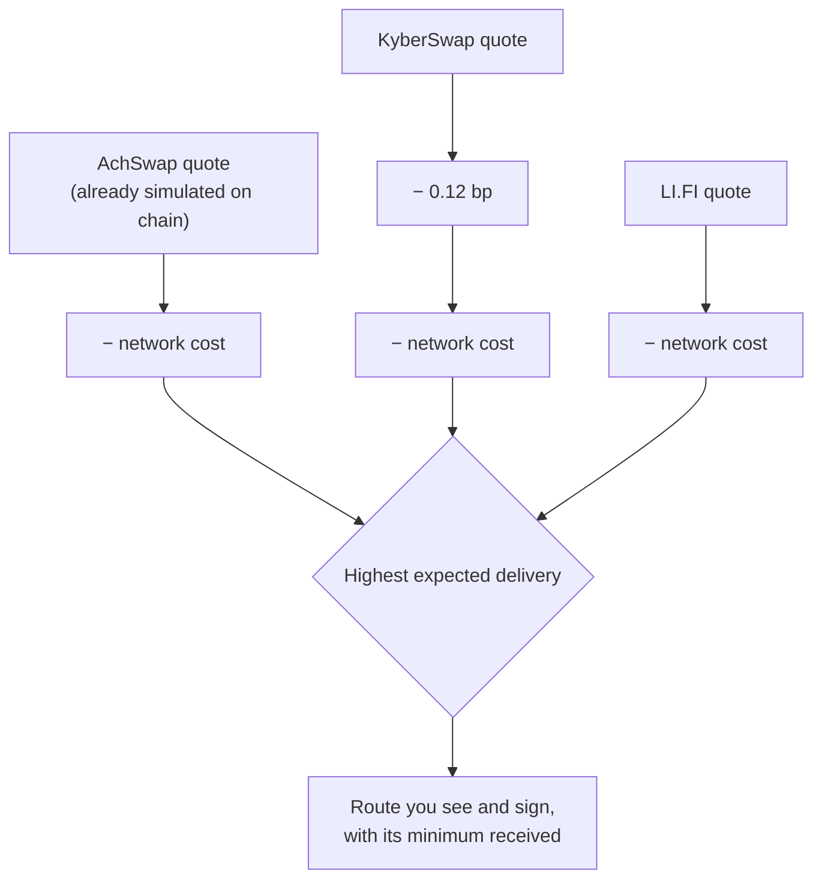

# Smart routing

Every swap is quoted by AchSwap's own router and by LI.FI and KyberSwap. The app shows and executes the route expected to leave you the most, after all fees and the network cost: see [how the best route is chosen](#how-the-best-route-is-chosen). No router can use liquidity it cannot see, so the result is the best of these three, not a guarantee of the best price anywhere.

## AchSwap's router

AchSwap's router covers the pools of every supported DEX on Arc. When you ask for a quote, it:

- checks direct pools and routes through deep intermediate tokens such as USDC, EURC and cirBTC, up to three hops;
- splits a trade across several pools and routes when the split pays more, including different DEXs in one trade;
- prices every candidate with the same integer math the pools themselves use;
- simulates the finished route as the real transaction before showing it, and shows it only if the result matches the quote to the unit.

The amount you see is what the contract pays out if the pools do not move before you sign.

AchSwap's router does not route tokens with transfer taxes or transfer restrictions. LI.FI or KyberSwap may still quote them.

Quotes normally take a fraction of a second. The first quote for a token the router has not seen before can take a second or two.

## What executes

An AchSwap route executes in **one transaction** on the `AchRouteExecutor` contract:

- Every split and hop runs atomically. If any part fails, the whole swap reverts and you keep your tokens.
- The AchSwap fee is **0.25% of the final output, charged once**, not per hop or per split. It goes straight to the AchSwap treasury Safe in the same transaction.
- You receive at least the minimum set by your slippage tolerance, measured on your actual balance, or the swap reverts.
- USDC can be paid directly from your balance, with no approval transaction.
- Gasless swaps work on AchSwap routes too, for USDC, EURC and cirBTC inputs. See [gasless](/achswap/gasless).

How the contract executes a route is described in [swap execution](/technical/swap-execution).

## Liquidity sources

| Source | Status |
| --- | --- |
| Uniswap V2, V3 and V4, including V4 pools with hooks | Live |
| AchSwap V2 and V3 | Live |
| Synthra V3 and UnitFlow V3 | Live |
| Slipstream pools: Aero CL (two factories), Archery, Topaz | Live |
| Lunya concentrated and constant-product pools | Live |
| DyorSwap, Architex, SushiSwap V3, Bugle, FlutchPad | Live |
| Virtuals launch curves (tokens that have not yet graduated to a regular pool) | Live |

A source contributes only when it has a pool with usable liquidity for your trade. New sources are added through the route executor's two-day security delay.

## Route shapes

AchSwap's router can build four kinds of route. The same shapes appear in KyberSwap's and LI.FI's routes, which use their own sources.

- **Direct**: one pool between your two tokens.
- **Multi-hop**: through one or two intermediate tokens, up to three hops, when there is no good direct pool.
- **Split**: the input is divided across several pools, up to eight branches, when one pool would move its price too far. Each branch can use a different DEX.
- **Mixed**: splits and hops together. The whole route still executes in one transaction.

The multi-hop and mixed examples are illustrative; the split is the route AchSwap's router chose in the [worked example](#a-worked-example) below.

## How the best route is chosen

The three providers don't produce their quotes the same way, so the app doesn't simply take the largest number. It compares what each route is **expected to deliver** to your wallet:

1. **Start from the quote.** Each provider's quoted output already has the pool fees and the AchSwap fee (0.25%) taken off.
2. **Take off the network cost.** On Arc, gas is paid in USDC from the same wallet, so a route that needs more gas leaves you with less. Each route's own gas estimate is priced at Arc's current gas price, converted into the token you receive, and subtracted from its quote.
3. **Take 0.12 bp off KyberSwap's quote.** AchSwap's quote is exact for the moment it was made: before it is shown, its route is simulated against the live contracts, and the quote is what that simulation paid out. KyberSwap's quote comes from KyberSwap's own model. When AchSwap simulated KyberSwap's own transactions in October 2026, they delivered a median 0.12 bp less than KyberSwap had quoted (39 trades; most routes 0.10–0.15 bp less, a few exactly the quote), while AchSwap's delivered exactly its quotes, so 0.12 bp is taken off KyberSwap's quote to compare like with like. LI.FI's quote is used as it is.
4. **The highest wins.** The route expected to deliver the most is used.

A basis point (bp) is 0.01%, so 0.12 bp is 0.0012%. The app also has a setting to prefer AchSwap's verified route when another provider is ahead by less than a small margin; it is currently set to **0**, so the highest expected delivery wins outright. These values are settings and may change as new measurements come in.

Gas matters most on small trades. On a swap of a dollar or two, a route that needs more gas can cost more in gas than its better price earns. On a large trade, gas is a tiny share of the amount, and the better price wins.

Some routes are left out before the comparison: a KyberSwap or LI.FI route through a token that takes a fee on transfers, or through a DEX that AchSwap has blocked. If such a route is the only one, it is shown with a warning. Exact-output trades are quoted only by AchSwap's router, so there is nothing to compare.

### A worked example

USDC to EURC at two sizes, quoted by AchSwap's router and by KyberSwap's public API (with AchSwap's integrator fee) at the same moment: 10 October 2026, 16:42:51 UTC, Arc block 25,271,330, gas price 20 gwei. Amounts are in EURC.

| 1 USDC → EURC | AchSwap | KyberSwap |
| --- | --- | --- |
| Route | Uniswap V3, one pool | Aero CL, one pool |
| Quoted output (fees included) | 0.890705 | 0.890898 |
| Gas estimate | 291,150 | 330,498 |
| Network cost, in EURC | 0.005199 | 0.005902 |
| KyberSwap adjustment (0.12 bp) | — | 0.000011 |
| **Expected delivery** | **0.885506** | **0.884986** |

KyberSwap's quote was 0.022% higher, but its route needed 39,348 more gas, worth more than that difference on a $1 trade. AchSwap's route was expected to deliver 0.059% more, so the app would mark it **Best**.

| 1,000 USDC → EURC | AchSwap | KyberSwap |
| --- | --- | --- |
| Route | Split: 66.6% Aero CL, 33.4% Topaz | Aero CL, one pool |
| Quoted output (fees included) | 890.925289 | 890.896029 |
| Gas estimate | 776,549 | 330,498 |
| Network cost, in EURC | 0.013871 | 0.005903 |
| KyberSwap adjustment (0.12 bp) | — | 0.010690 |
| **Expected delivery** | **890.911418** | **890.879436** |

At this size the split route's extra gas (about one cent) is worth paying: it delivers about 0.032 EURC more. Prices change every block, so the same request a minute later can rank the other way.

## Quoted output, minimum and what you receive

| Figure | What it is |
| --- | --- |
| **Quoted output** | What the route pays if the pools don't move before your transaction. For AchSwap routes it was simulated at the quote's block. |
| **Minimum received** | Quoted output less your slippage tolerance. Enforced on chain: below it, the transaction reverts. |
| **What you receive** | Whatever the route pays when your transaction is mined: usually close to the quote, never below the minimum. |
| **Network cost** | Paid in USDC from your wallet, separately from the output. Not included in the quoted output. |

**Freshness.** Quotes refresh every 30 seconds by default, and every time you change the amount or tokens. The app's servers may reuse a quote for the same request for a few seconds. A quote is a snapshot: the longer you wait before confirming, the more the price can move. The [swap settings](/achswap/swap#settings) control the refresh interval, slippage and deadline.

**Why another aggregator can show a different route.** Every aggregator sees a different set of pools, prices gas differently, and charges different fees. A route that looks better elsewhere may be a quote from a model rather than a simulation, may need more gas, or may use a source AchSwap doesn't index. AchSwap compares the three providers it queries, after gas and fees; it doesn't claim the best price across every venue.

## Route details

Next to the exchange rate, the app shows the logo of the provider that found the route, followed by the logos of every DEX the route trades on. Protocols without a published logo show their initials.

Open **Trade details** to see the exchange rate, price impact, minimum received, slippage and the **network cost**: the route's gas estimate at Arc's current gas price.

Turn on **Detailed route** in your account menu to also see the route and every provider's quote. These settings only change what is displayed, never the quote.

**The route** is shown as **Text** or as a **Map** (one at a time). The map can be dragged and zoomed with its controls, the scroll wheel or a pinch:

- Each split with its share of your input, and every hop's DEX, pool fee and pool address.
- A shield marks a pool that was checked:
  - On AchSwap routes, the executor resolves every pool on chain from a known factory.
  - On KyberSwap and LI.FI routes, each pool is checked against AchSwap's index of known factories. A warning marks a pool from a factory AchSwap does not track.
  - LI.FI does not name its pools, so the app finds them by simulating LI.FI's exact transaction.

**You receive, after gas** lists what the routes of AchSwap's router, KyberSwap and LI.FI each leave you for the same trade once their gas is paid: the figure the routes are ranked by.

- **Best** marks the route the app uses.
- The percentage next to another provider is how far behind it is. See [how the best route is chosen](#how-the-best-route-is-chosen).
- If a provider did not quote, it says why (for example, LI.FI needs a connected wallet).

For an exact-output trade, the list shows the input each provider quoted instead.

Routes and amounts can change whenever the quote refreshes, so always review the current quote right before signing.

Technical details are in [routing engine](/technical/routing-engine).
