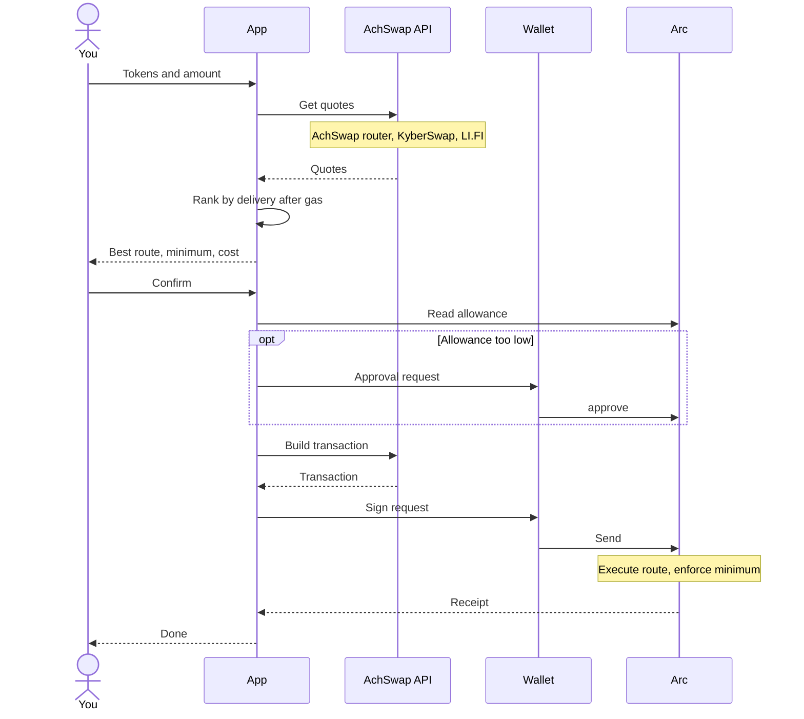

# Swap tokens

1. Open [trade.achswap.app](https://trade.achswap.app) and connect your wallet on [Arc Mainnet](/getting-started/network-setup). Check that the chain ID is 5042.
2. Choose the input and output tokens, and enter an amount.
3. Review the estimated output, minimum received, price impact and route before confirming.

Your wallet may ask for an ERC-20 approval for the route's spender. Keep some USDC for gas.

Every quote compares three providers: AchSwap's own router, LI.FI same-chain swaps and KyberSwap. The app shows the one expected to leave you the most, after all fees and the network cost: see [how the best route is chosen](/achswap/smart-routing#how-the-best-route-is-chosen). The DEXs AchSwap's router covers are listed under [liquidity sources](/achswap/smart-routing#liquidity-sources).

Only pools with usable liquidity contribute. LI.FI and KyberSwap are independent, third-party routing providers. The winning route reflects the quotes available at that moment, so it can change on refresh.

## What happens when you swap

Two things are worth knowing about this flow:

- **Nothing is sent until you confirm in your wallet.** Quotes and transaction building happen off chain. The approval and the swap are the only transactions, and you sign both.
- **The route's contract depends on the provider.** An AchSwap route executes on AchSwap's route executor; a KyberSwap or LI.FI route on that provider's contract. Each needs its own approval. See [architecture](/technical/architecture).

With [gasless mode](/achswap/gasless) on, you sign a message instead of sending the swap, and a relayer submits it.

## Paying with USDC

USDC on Arc is both the gas currency and an ERC-20 token. AchSwap routes can take USDC straight from your balance, so a swap from USDC needs no approval transaction.

## Exact output

Enter an amount in the **To** field to set exactly how much you want to receive. Only AchSwap's router quotes exact output; KyberSwap and LI.FI only quote exact input. The swap spends the quoted input plus your slippage tolerance and guarantees at least the amount you entered. If the price holds, you receive slightly more. See [exact output](/technical/routing-engine#exact-output).

## Route details

Next to the exchange rate, logos show which provider found the route and which DEXs it uses. Open **Trade details** under the quote for the exchange rate, price impact, minimum received, slippage and network cost. Turn on **Detailed route** in your account menu to see the route itself, as text or as an interactive map, and what each provider's route would leave you after gas. These settings only change what is displayed, never the quote. Everything shown is explained under [route details](/achswap/smart-routing#route-details).

When you confirm a swap, **Show more** in the confirmation repeats the route and the network cost.

## Settings

Open the gear icon to change:

| Setting | Default | What it does |
| --- | --- | --- |
| Slippage tolerance | 0.5% | How far the price may move against you before the swap reverts. Presets 0.1%, 0.5% and 1%, or type your own. |
| Transaction deadline | 20 minutes | A swap still pending after this long reverts instead of executing at an old price. |
| Auto-refresh | 30 seconds | How often the quote reprices while you look at it. Click the timer to reprice now. |
| Recipient | Your wallet | Send the output to another address. Not available with gasless swaps. |

**Choosing slippage.** With 0.5% on a quote of 100 EURC, the minimum received is 99.5 EURC: you get at least that, or the swap reverts and you keep your tokens. Stable pairs rarely need more than 0.5%. Volatile or thinly traded tokens may need 1% or more. Higher slippage never improves your price. It only lets the trade go through at a worse one.

## Warnings you may see

| Warning | What it means |
| --- | --- |
| **Price impact** in amber (above 2%) or orange (above 5%) | Your trade is large for the available liquidity. Consider a smaller amount. |
| **High price impact** (15% or more) | You'll get far fewer tokens than the market price suggests. The app asks you to confirm before it lets you swap. |
| **Price impact unknown** | The impact couldn't be measured, which usually means very thin liquidity. Treated like high impact: you must confirm. |
| **Unverified token** | The token isn't on AchSwap's list. Check its contract address before you trade it. |
| **No provider can sell this back** | Neither AchSwap nor KyberSwap can find a route to sell the token. You may only be able to sell it where it launched. |
| **V4 pool with custom hooks** | The route uses a Uniswap V4 pool whose hook can change fees. Your minimum is still protected, but you may need to retry. |

## Price impact

Price impact is what the route pays against market reference prices, before the AchSwap fee, and it is measured the same way for every provider. High price impact means the trade is large relative to the available liquidity, or the route goes through high-fee pools. Check the route and the minimum received: a higher slippage tolerance does not create liquidity or improve the quoted price.

See [smart routing](/achswap/smart-routing), [gasless swaps](/achswap/gasless), [fees](/technical/fee-structure) and [contract addresses](/technical/contract-addresses).
