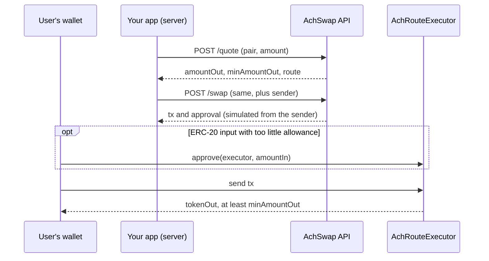

# Developer API

The AchSwap Developer API gives your application AchSwap's best route on Arc Mainnet. You send a token pair and an amount; it sends back a quote, or a ready-to-sign transaction that executes the swap. You can add your own fee on top, paid to your address in the same transaction.

| | |
| --- | --- |
| Base URL | `https://trade.achswap.app/api/v1` |
| Endpoints | [`POST /quote`](/developers/api-reference#post-quote) and [`POST /swap`](/developers/api-reference#post-swap) |
| Format | JSON in, JSON out |
| Network | Arc Mainnet, chain ID `5042` |
| Executes on | AchRouteExecutor `0x1B844738455b8060D12839331b35893526E9d314` |
| Trades | Exact input. The API doesn't offer exact-output or gasless swaps. |

## How a swap works

Your server talks to the API. Your user's wallet signs and sends the transaction. AchSwap never holds your user's funds or keys.



1. **Quote.** `POST /quote` returns the expected output, the minimum after slippage, the fees and the route. Use it to show your user a price.
2. **Build.** When the user is ready, `POST /swap` with their address as `sender`. The API prices the trade again, builds the transaction, and simulates it from the sender before returning it.
3. **Approve.** If the input is an ERC-20 token, the sender approves the executor for the input amount, unless the allowance is already enough.
4. **Send.** The user signs and sends the transaction. The executor runs the route and pays the recipient, or reverts if the output would fall below `minAmountOut`.

## Get an API key

Email **[support@achswap.app](mailto:support@achswap.app)** with:

- your project's name and website;
- what you'll use the API for, and roughly how many requests a day;
- a contact for technical and security notices.

You receive one key. Keep it secret and call the API from your server, never from a browser. Responses carry no CORS headers, so a browser on another site can't read them anyway. AchSwap stores only a hash of your key, so a lost key can't be recovered: ask for a new one, and the old one is revoked.

## Authentication

Send the key with every request, in either header:

```http
x-api-key: ach_dev_…
Authorization: Bearer ach_dev_…
```

A missing, wrong or revoked key gets `401 UNAUTHORIZED`.

## Your first request

Quote 1 USDC to EURC, with a 0.30% fee for you:

```bash
curl -s https://trade.achswap.app/api/v1/quote \
  -H "x-api-key: $ACHSWAP_KEY" \
  -H "content-type: application/json" \
  -d '{
    "tokenIn": "0x3600000000000000000000000000000000000000",
    "tokenOut": "0xbEf5f6d51CB62b58e6A8f77868681825C6fe21c1",
    "amountIn": "1000000",
    "feeBps": 30,
    "feeRecipient": "0xYourFeeAddress"
  }'
```

`amountIn` is `1000000` because USDC has 6 decimals. The response's `amountOut` is what the user would receive, after AchSwap's fee and yours.

## Next

- [API reference](/developers/api-reference): every field, token addresses and decimals, and how fees are calculated.
- [Code examples](/developers/examples): a complete swap in TypeScript and Python.
- [Errors and limits](/developers/errors-and-limits): what each error means, when to retry, and rate limits.

## Support

Questions, a new key, higher limits or a security report: **[support@achswap.app](mailto:support@achswap.app)**. Include the `requestId` from the response when you ask about a specific request.
