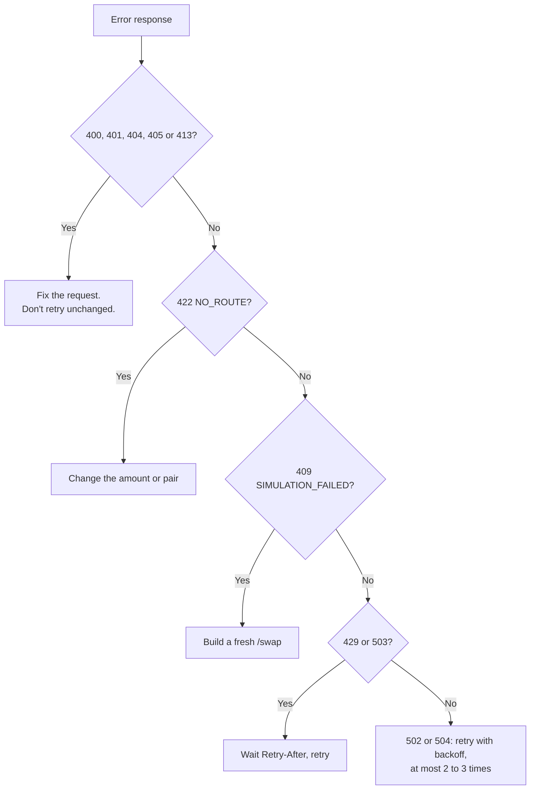

# Errors and limits

## Error format

Every error has the same shape, with a machine-readable `code` and a human-readable `message`:

```json
{
  "error": {
    "code": "SIMULATION_FAILED",
    "message": "The output at the latest block is below minAmountOut: request a new quote or allow more slippage",
    "reason": "Slippage"
  },
  "requestId": "req_5f2c9a0b1d3e4f67"
}
```

The same `requestId` is in the `X-Request-Id` header of every response, successful or not. Log it, and include it when you contact support.

Branch on `code`, not on `message`: messages may be reworded.

## Error codes

| HTTP | `code` | Meaning | What to do |
| --- | --- | --- | --- |
| 400 | `INVALID_REQUEST` | A field is missing or invalid, or the body isn't JSON. The message names the field. | Fix the request. Don't retry unchanged. |
| 401 | `UNAUTHORIZED` | Missing, wrong or revoked API key. | Check the header. Ask for a new key if it was revoked. |
| 404 | `NOT_FOUND` | Unknown path. | Use `POST /quote` or `POST /swap`. |
| 404 | `API_DISABLED` | The API is temporarily switched off. | Retry later. |
| 405 | `METHOD_NOT_ALLOWED` | Not a POST. | Use POST with a JSON body. |
| 409 | `SIMULATION_FAILED` | The transaction would revert. See `reason` below. | Build a fresh `/swap`, or tell the user. |
| 413 | `INVALID_REQUEST` | Body larger than 16 KB. | Send a smaller body. |
| 422 | `NO_ROUTE` | No route for this pair and amount. | Try a smaller amount, or another pair. Tokens with transfer taxes or restrictions are never routable. |
| 429 | `RATE_LIMITED` | Over your key's per-minute limit, or too many requests with a bad key from your IP. | Wait for `Retry-After` seconds. |
| 429 | `CONCURRENCY_LIMITED` | Too many requests in flight on your key at once. | Wait for one to finish, then retry. |
| 502 | `INTERNAL` | The route couldn't be prepared. | Retry once or twice with backoff. |
| 503 | `OVERLOADED` | The API is busy. | Wait for `Retry-After` seconds. |
| 503 | `UNAVAILABLE` | Routing is briefly unavailable. | Retry with backoff. |
| 504 | `TIMEOUT` | Routing took too long. | Retry with backoff. |

### Simulation failures

A `409 SIMULATION_FAILED` comes with a `reason` from the executor when there is one:

| `reason` | Meaning | Fix |
| --- | --- | --- |
| `Slippage` | The output would fall below `minAmountOut`. | Request a fresh `/swap`. If it keeps happening, the pair is volatile: allow more slippage. |
| `Expired` | The deadline has passed. | Use a later `deadline`, or leave it out for the 20-minute default. |
| `Paused` | The executor is paused. | Retry later. |
| `StaleFeeConfig` | AchSwap's fee changed since the quote. | Request a fresh `/swap`. |
| `InvalidRoute`, `InvalidConfig` | The route is no longer valid, for example a pool changed. | Request a fresh `/swap`. |
| `InvalidValue` | The transaction value doesn't match the input. | Send `tx.value` exactly as returned. |
| `UnsupportedToken` | A token in the route can't be settled exactly. | Choose another token. |
| `NativeTransferFailed` | The recipient or fee recipient can't receive native USDC. | Use an address that can, or take the ERC-20 (`0x3600…`) as output. |
| `Error` or none | Another revert, often an allowance or balance the sender doesn't have. | Check the sender's balance. |

## When to retry



Retry with exponential backoff (for example 0.5 s, 1 s, 2 s) and give up after a few attempts. When `Retry-After` is present, wait at least that long.

## Rate limits

| Limit | Value |
| --- | --- |
| Requests per key | Set per key, 60 a minute unless agreed otherwise. |
| Requests in flight per key | 2 at a time. |
| Request body | 16 KB. |

Responses to an authenticated request tell you where you stand:

| Header | Meaning |
| --- | --- |
| `X-RateLimit-Limit` | Your key's requests per minute. |
| `X-RateLimit-Remaining` | Requests left in the current window. |
| `Retry-After` | On 429 and 503: seconds to wait. |

To stay within limits:

- Quote when the user pauses typing, not on every keystroke.
- Share one quote between users looking at the same pair and amount, for a few seconds.
- Call `/swap` only when a user confirms.

Need more? Email [support@achswap.app](mailto:support@achswap.app) with your expected volume.

## Troubleshooting

For problems your users may report from the app itself (failed swaps, approvals, gasless), see the user [troubleshooting guide](/help/troubleshooting).

| Symptom | Likely cause |
| --- | --- |
| Every request returns 401 | The key is in the wrong header, or has spaces or a line break around it. |
| `amountOut` looks a million times too small or too large | The amount's decimals are wrong. USDC is 6 as the ERC-20 and 18 as native. |
| The transaction reverts on chain with an allowance error | The approval wasn't confirmed before the swap was sent. Wait for the approval's receipt. |
| The swap reverts with `Slippage` on chain | Too long passed between `/swap` and sending. Build the transaction right before signing. |
| A user can't swap their whole USDC balance | The balance also pays gas. Leave a little for the fee. |
| Your fee isn't arriving | `feeBps` is 0, or `feeRecipient` is missing. Check `fees.partnerAmount` in the response. |
