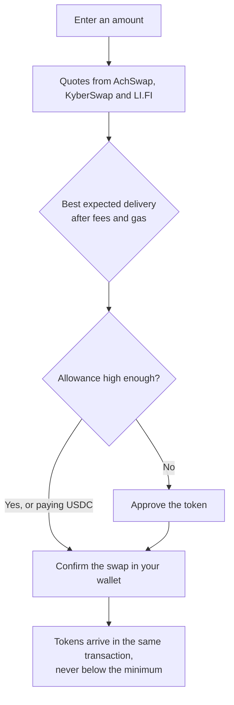

# Quick start

This walks you through your first swap on AchSwap. It takes a few minutes if your wallet already has USDC on Arc.

## What you need

- An EVM wallet such as MetaMask, Bitget Wallet, or any wallet that supports WalletConnect. See [wallet setup](/getting-started/wallet-setup).
- Some **USDC on Arc**. USDC pays Arc's network fees, so you need a little even if you plan to trade something else. If your funds are on another chain, use the [Bridge](/achswap/bridge) first.

## Your first swap

1. **Open the app** at [trade.achswap.app](https://trade.achswap.app) and click **Connect Wallet**.
2. **Check the network.** Your wallet should be on Arc Mainnet, chain ID 5042. If it isn't, the app offers to switch. [Network setup](/getting-started/network-setup) has the values if you need to add Arc by hand.
3. **Pick your tokens.** Choose what you pay in the top field and what you receive in the bottom one. Search by name, symbol or contract address.
4. **Enter an amount.** A quote appears within a second or so. It refreshes on its own every 30 seconds while you decide.
5. **Read the quote.** Before you confirm, look at:
   - **Minimum received**: the least you will get. If the price moves further than your slippage setting, the swap cancels itself instead of paying less.
   - **Price impact**: how much your trade moves the price. Under 1% is normal for liquid pairs. The figure turns amber above 2% and red from 15%, where the app asks you to confirm the trade before it lets you swap.
   - **Network cost**: the gas, paid in USDC.
6. **Approve, if asked.** When you sell a token other than USDC, your wallet asks for an approval so the swap contract can take that token. By default the approval is for exactly this swap, so each swap asks again; the **Enable unlimited approval** switch on the swap page avoids that. USDC needs no approval on AchSwap routes.
7. **Confirm the swap** in your wallet. The app shows progress and a link to the transaction on the explorer.

## If something goes wrong

| What you see | What to do |
| --- | --- |
| No route found | Try a smaller amount, or check the token has a pool with liquidity on Arc. |
| Transaction reverted | The price moved past your minimum, or the deadline passed. Refresh the quote and try again. Raise slippage only if the token is volatile. |
| Not enough USDC for gas | Keep at least a few cents of USDC in your wallet. |
| Token not in the list | Paste its contract address. Unverified tokens show a warning: check the address before trading. |

## Next steps

- Turn on [gasless swaps](/achswap/gasless) if you'd rather sign than pay gas.
- [Add liquidity](/achswap/add-liquidity) to earn trading fees.
- Visit [Quests](/quests/overview): your swaps already earn XP.
