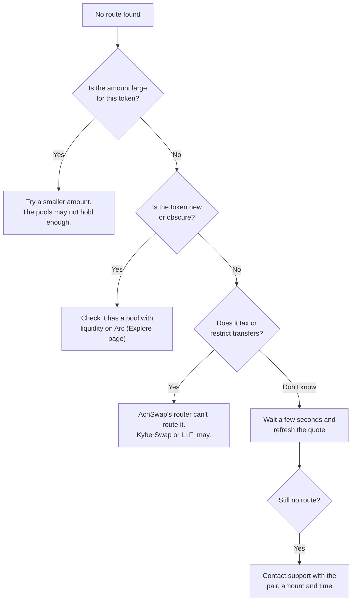
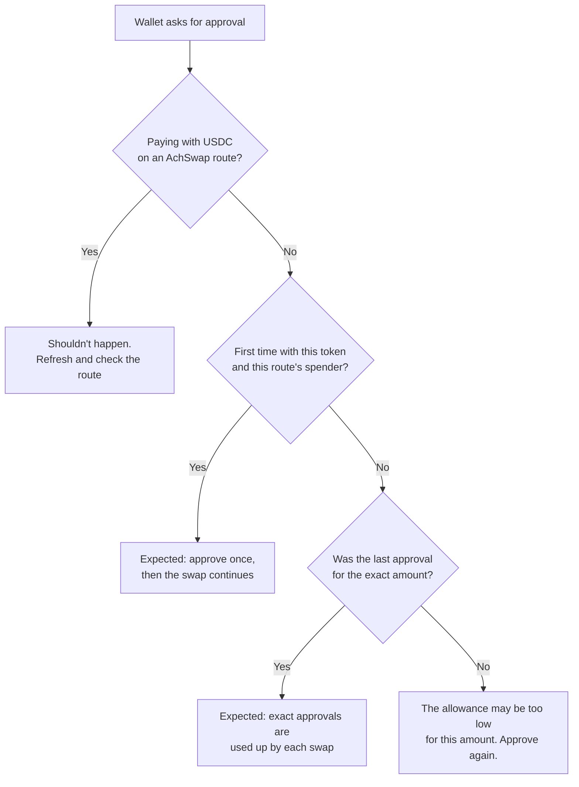
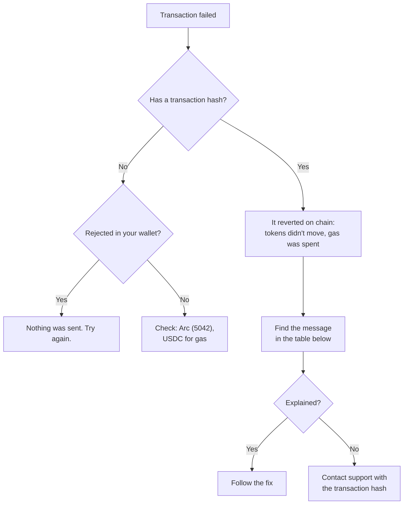
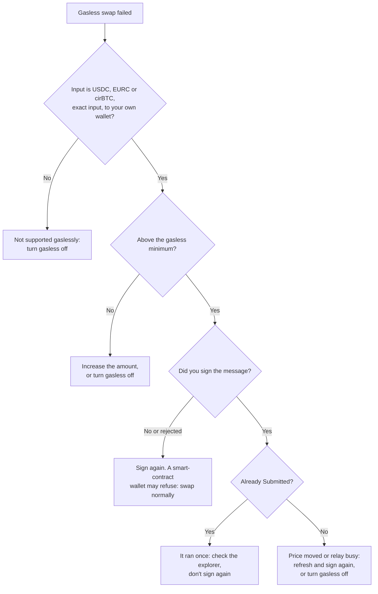
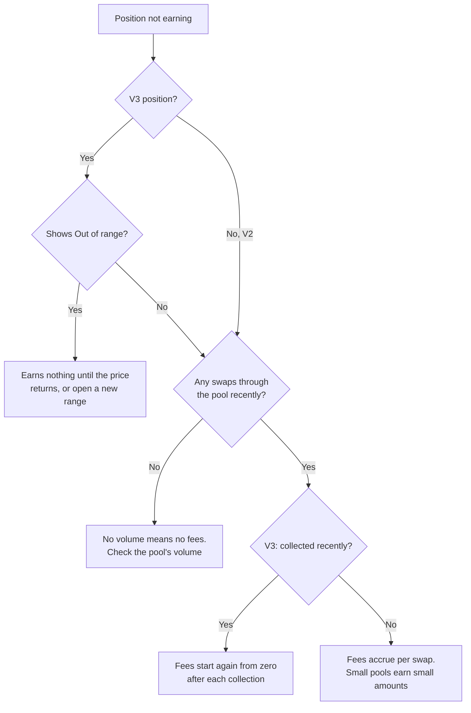
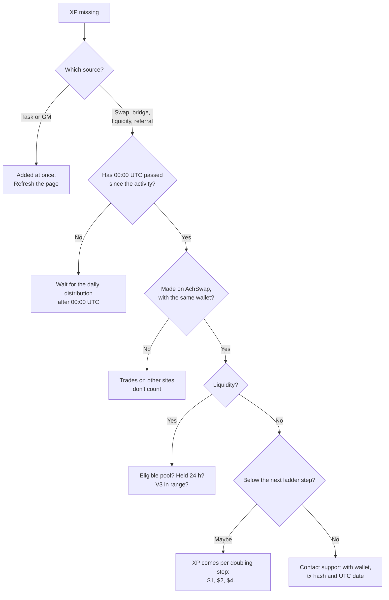

# Troubleshooting

Find your problem below. Each section says what you'll see, the likely causes, what to try, and when to contact support.

:::danger Never share these
Nobody from AchSwap will ever ask for your **seed phrase**, **private key**, or for you to **sign a message** to "verify" or "unlock" your wallet. Anyone who asks is trying to take your funds. Support only needs public information: your wallet address and transaction hashes.
:::

## What to send support

Email **[support@achswap.app](mailto:support@achswap.app)** with:

- your **wallet address**;
- the **transaction hash**, if there is one (from your wallet's activity, or the explorer link the app showed);
- the **time** it happened, in UTC if you can;
- what you were doing: the tokens, the amount, and which page;
- the **error message** exactly as shown, or a screenshot of the page (not of your wallet's recovery screen);
- for Developer API problems, the `requestId` from the response.

## No swap route available

**What you see:** "No route found for this pair and amount with the enabled protocols", or no quote appears.

**Likely causes:** not enough liquidity for the amount; no pool for the token on any supported DEX; a token with transfer taxes or restrictions, which AchSwap's router never routes; or a provider being briefly unavailable.

**Try:** a smaller amount; check the token on [Explore](/achswap/explore); wait and refresh.

**Contact support** if a pair that normally works has had no route for several minutes.

## Insufficient liquidity or high price impact

**What you see:** "Not Enough Liquidity", a price impact figure in amber or red, or "High price impact" asking you to confirm.

**Likely causes:** your trade is large compared with the liquidity in the pools, so it moves the price.

**Try:** a smaller amount, or split the trade over time. Check the [price impact guide](/achswap/swap#warnings-you-may-see). Raising slippage does not add liquidity.

## The quote changed

**What you see:** the output amount moves between refreshes, or the route changes provider.

**Likely causes:** prices move with every trade on Arc. Quotes refresh every 30 seconds by default, and each refresh can find a different best route. A refresh can also lose a route that was available a moment before.

**Try:** this is normal. Review the quote right before confirming. See [smart routing](/achswap/smart-routing#how-the-best-route-is-chosen).

## Why is a token approval required?

**What you see:** your wallet asks you to approve a token before the swap or deposit.

**Why:** a contract can only move your tokens after you approve it. Each route type has its own spender: AchSwap's route executor, KyberSwap's router or LI.FI's contract. By default the app approves exactly the amount of the swap, so the next swap asks again. The swap page's **Enable unlimited approval** switch avoids the repeat, at the cost of a standing approval. See [approvals](/technical/security#approvals).

**Approval failed:** check you have USDC for gas, then try again. If your wallet shows an error, read it: a rejected request means nothing was sent.

## Why did my transaction fail?

**What you see:** the wallet or the app shows the transaction failed or reverted.

A reverted transaction doesn't move your tokens, but it still costs gas. Common messages:

| Message | Meaning | What to do |
| --- | --- | --- |
| Price Moved | The output fell below your minimum before the transaction confirmed. | Refresh the quote and try again. |
| Not Enough Slippage | Below the minimum; can also mean the token charges a transfer fee. | For a taxed token, set slippage above its fee. |
| Transaction Expired | The deadline passed before it confirmed. | Try again, or raise the deadline in settings. |
| Approval Needed | The allowance is missing or too low. | Approve, wait for it to confirm, then swap. |
| Insufficient USDC | Not enough USDC for the amount plus gas. | Lower the amount or add USDC. |
| Protocol Fee Changed | AchSwap's fee changed after the quote. | Refresh the quote. You were not charged the new fee. |
| Route No Longer Valid | The route went stale. | Refresh the quote. |
| Token Transfer Failed | The token refused the transfer: paused, taxed, or blocking the contract. | Check the token with its issuer. |
| Simulation Failed | The transaction would fail if sent, so it wasn't. | Refresh and retry; check balance and allowance. |

**Contact support** with the transaction hash if the message doesn't explain it.

## Why did a gasless swap fail?

**What you see:** a gasless-specific error, or the swap falls back to asking for gas.

**Likely causes:** the amount is below the token's gasless minimum; the route or token isn't supported gaslessly; the signature was rejected or expired; or the price moved while the relayer submitted it.

**Good to know:** if a gasless swap fails, nothing leaves your wallet and you pay nothing. The one-time Permit2 approval is a normal transaction you paid gas for. A signed swap can execute only once. See [gasless swaps](/achswap/gasless#if-a-gasless-swap-fails).

## Unsupported tokens

**What you see:** "Token Charges a Transfer Fee", "Fee-on-Transfer Token", no AchSwap route, or a warning that no provider can sell the token back.

**Why:** AchSwap's router only routes tokens whose transfers move exactly the amount requested. Taxed, rebasing and restricted tokens can't settle that way. KyberSwap or LI.FI may still offer a route. A "can't sell back" warning means neither AchSwap nor KyberSwap found a route to sell the token: you might not be able to sell it after buying.

**Try:** check the token's contract address and its issuer's documentation. Be cautious with tokens that can't be sold back.

## Bridge transfer delayed or stuck

**What you see:** the bridge shows the transfer pending for longer than its estimate, or the funds haven't arrived.

**Try, in order:**

1. Keep the Bridge page open and check the transfer's status in the widget's history.
2. Check your balance on the **destination** chain. Some routes deliver a different token than expected, for example a bridged version.
3. Check the **source** chain for a refund. A failed transfer is usually refunded there, sometimes as a different token, and refunds can take time.
4. For Solana, check your balance before retrying: LI.FI can report a timeout for a transfer that went through.

**Contact support** if nothing has arrived or been refunded after several hours. Include the source transaction hash. Bridges are run by third parties through LI.FI; AchSwap can help investigate but doesn't control them. See [bridge](/achswap/bridge#if-a-transfer-seems-stuck).

## Why is my liquidity not earning fees?

**Good to know:** V2 fees are added to the pool, so they show up as a slowly growing withdrawal value rather than a separate balance. V3 fees accrue to the position and are collected with **Collect Fees** or when you withdraw. See [liquidity earnings and risks](/achswap/liquidity-earnings).

## Why hasn't my XP appeared?

See [how to earn XP](/quests/earning-xp) for the rules and [when XP is added](/quests/distribution).

## Still stuck?

Check the [FAQ](/technical/faq), then email **[support@achswap.app](mailto:support@achswap.app)** with the information listed in [what to send support](#what-to-send-support).
