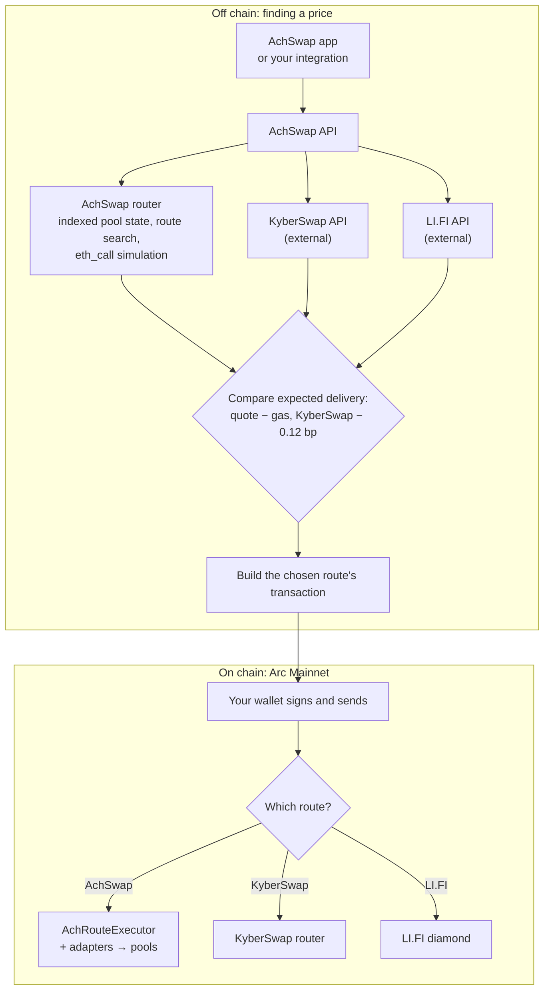

# Architecture

AchSwap is a DEX aggregator: it finds a price for your trade across every source it can reach on Arc, then hands your wallet a transaction to execute it. Finding the price happens **off chain**, on AchSwap's servers and the providers it asks. Executing it happens **on chain**, in a transaction your wallet signs and sends. No AchSwap server ever holds your tokens or your keys.

## A swap request, end to end

The partner [Developer API](/developers/developer-api) uses the left-hand path with AchSwap's router only: it returns AchRouteExecutor transactions and does not include KyberSwap or LI.FI routes.

## The pieces

| Component | Where it runs | What it does |
| --- | --- | --- |
| **AchSwap app** | Your browser | Collects the trade, shows quotes and the route, checks allowances, asks your wallet to sign. |
| **AchSwap API** | AchSwap servers | Takes quote and build requests, validates them, applies rate limits and attaches AchSwap's integrator fee to KyberSwap and LI.FI requests. Identical quotes requested within a few seconds share one result. |
| **AchSwap router** | AchSwap servers | Keeps the state of every supported pool on Arc in memory, updated block by block from Arc's RPC. Searches direct, multi-hop and split routes, prices them with each pool's own integer maths, and executes the finished route as an `eth_call` before returning it. See [routing engine](/technical/routing-engine). |
| **KyberSwap and LI.FI** | External services | Independent aggregators. AchSwap asks them for exact-input quotes and uses their transactions as they build them. |
| **Route comparison** | The swap page | Ranks the providers' quotes by what each is expected to deliver after gas. See [how the best route is chosen](/achswap/smart-routing#how-the-best-route-is-chosen). |
| **Gasless relay** | AchSwap servers | For [gasless swaps](/technical/gasless): checks a signed order, simulates it and submits it, paying the gas. |
| **AchRouteExecutor** | Arc Mainnet | Executes an AchSwap route atomically through its [execution adapters](/technical/swap-execution#adapters), takes the 0.25% fee, and enforces your minimum. |
| **AchSponsoredExecutorV3** | Arc Mainnet | Executes a gasless swap exactly as signed, through Permit2. |

## Off chain versus on chain

What you can rely on is decided on chain:

- **Your minimum is enforced on chain.** Every route, whoever built it, carries a minimum output. If the pools have moved and the output would be smaller, the transaction reverts and you keep your input.
- **Quotes are estimates.** A quote describes the state at one moment. AchSwap's router simulates its own routes against that state, so its quote is exact for that block. KyberSwap's and LI.FI's quotes come from their own models.
- **Simulation is a check, not a guarantee.** A transaction that simulated correctly can still revert if the state changes before it is mined, for example because another trade moved the price.

Next: [swap lifecycle](/achswap/swap#what-happens-when-you-swap) for the user's view, [smart contracts](/technical/smart-contracts) for what runs on chain, and [security](/technical/security) for trust assumptions.
