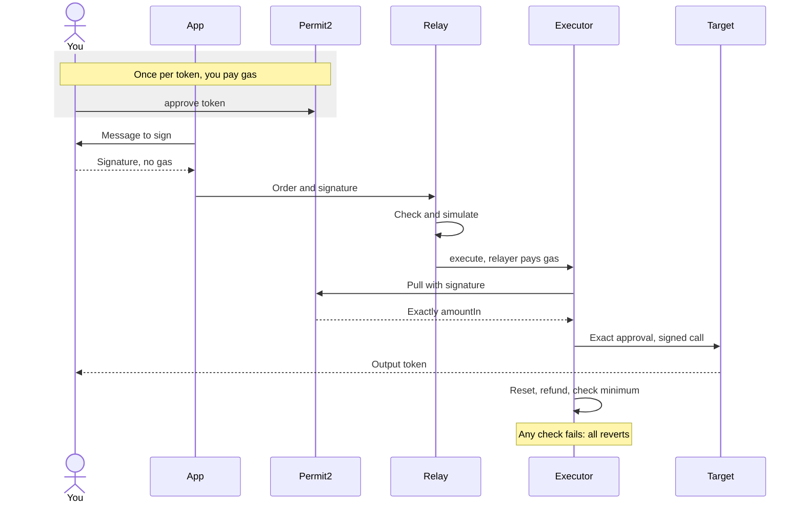
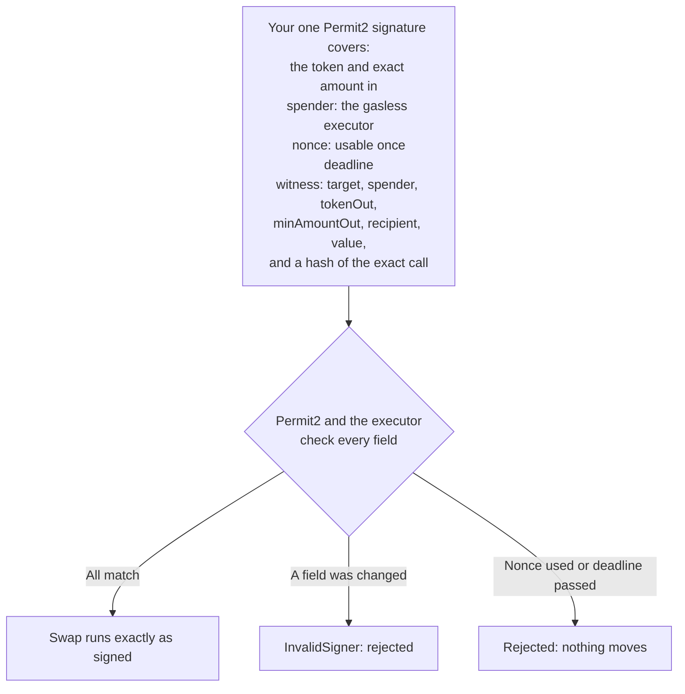

# Gasless architecture

Gasless swaps let you trade without holding gas. You sign once, an allowlisted relayer submits the transaction and pays the gas, and the `AchSponsoredExecutorV3` contract executes exactly what you signed.

## Components

| Component | Role |
| --- | --- |
| Wallet | Signs one Permit2 `PermitWitnessTransferFrom`, with the swap as its witness. |
| AchSwap app | Builds the route calldata (a KyberSwap build, a LI.FI transaction or an AchRouteExecutor call), the order and the signature request. |
| Relay | Validates the order and signature off chain, simulates the swap, and broadcasts it from an allowlisted relayer wallet. |
| `AchSponsoredExecutorV3` | Pulls the input through Permit2, calls the allowlisted target, and checks the minimum output against the recipient's balance. |
| Permit2 | Verifies the signature (token, amount, spender, nonce, deadline, chain and witness) and moves the input. |
| Targets | KyberSwap router, LI.FI diamond and AchRouteExecutor. |

## Flow

The first gasless swap of a token needs one ordinary transaction, which you pay for: an approval of that token to Permit2. Every gasless swap after that is a signature only.



Who does what: **you** sign once (and pay for the one-time approval); **the relayer** pays the swap's gas and can only submit what you signed; **the executor** enforces the order on chain.

1. The app gets a quote. Gasless applies to exact-input swaps from USDC, EURC or cirBTC through KyberSwap, LI.FI or AchSwap's router, when the input is above the USD minimum.
2. If the input token has no Permit2 allowance yet, you send a one-time ERC-20 approval to Permit2.
3. The app builds the target calldata with the executor as sender and you as recipient. It then builds the order:
   `(user, tokenIn, amountIn, nonce, deadline, target, spender, tokenOut, minAmountOut, recipient, value, callData)`.
4. You sign once, and the app sends the order and signature to the relay.
5. The relay checks the order and recovers the signer. It simulates `execute(order, signature)` and refuses anything above its gas limit. Then it submits the transaction, never with native value attached.
6. On chain, the executor:
   - checks the relayer, the input, target and spender allowlists, the value rules and the deadline;
   - calls `Permit2.permitWitnessTransferFrom` with a witness it recomputes from the order;
   - approves exactly the input to the spender and calls the target;
   - resets the approval and refunds any unused input to you;
   - forwards any output left on the executor, then requires the recipient's balance to have increased by at least `minAmountOut`.

For an AchSwap route, the target is AchRouteExecutor. Its `execute()` call names you as the recipient, so the route executor pays you directly and the gasless executor checks your balance increase.

## The signature

Domain: `{ name: "Permit2", chainId: 5042, verifyingContract: 0x000000000022D473030F116dDEE9F6B43aC78BA3 }`.

```text
PermitWitnessTransferFrom(TokenPermissions permitted,address spender,uint256 nonce,uint256 deadline,SponsoredSwap witness)
SponsoredSwap(address target,address spender,address tokenOut,uint256 minAmountOut,address recipient,uint256 value,bytes32 callDataHash)
TokenPermissions(address token,uint256 amount)
```

- `spender` in the permit is the executor, and `callDataHash` is `keccak256(callData)`.
- The executor recomputes the witness from the order it receives. If a relayer changes any field, Permit2 rejects the signature with `InvalidSigner`.
- The Permit2 nonce is the only nonce, so a signature executes at most once. You can cancel it with `invalidateUnorderedNonces`.
- `executor.signingDigest(order)` returns the exact digest a wallet signs.

### What your signature authorizes



- **You authorize:** moving exactly `amountIn` of one token from your wallet, once, before the deadline, into one specific swap whose call, output token, minimum and recipient you signed.
- **The relayer can:** submit the order unchanged, or not submit it.
- **The relayer cannot:** change any field, pull more than `amountIn`, send the output elsewhere, lower your minimum, or use the signature twice.
- **Expiry and replay.** The deadline is checked by Permit2 and by the executor; AchSwap's relay refuses deadlines more than three hours ahead. The Permit2 nonce is spent on first use, so a replay fails. To cancel an unused signature, call `invalidateUnorderedNonces` on Permit2, or let it expire.
- **When something fails.** If the relay's simulation fails, it doesn't submit, and nothing happens on chain. If the transaction reverts on chain (for example the price moved below your minimum), Permit2's transfer is undone with it: nothing leaves your wallet and the relayer bears the gas. The nonce stays unused, so that signature remains valid until its deadline and could still execute later on the same terms (never below your minimum). To rule that out, invalidate its nonce on Permit2.

## Arc USDC rules

Arc has one USDC balance with two views: the 6-decimal ERC-20 at [`0x3600000000000000000000000000000000000000`](https://arc.etherscan.io/address/0x3600000000000000000000000000000000000000) and the 18-decimal native currency.

- **USDC input** is always signed as `tokenIn = 0x3600…` with a 6-decimal amount.
  - Allowance mode, used by every route AchSwap builds today: `spender` is the target and `value = 0`.
  - Native-forward mode: `spender = 0x0` and `value = amountIn × 10^12`. The executor forwards the pulled USDC as native value. The contract supports this mode, but AchSwap's current routes do not use it.
- **USDC output** is signed as `tokenOut = 0x0000000000000000000000000000000000000000`, with `minAmountOut` in 18-decimal wei. The executor then measures the native balance. Signing `0x3600…` as the output reverts with `InvalidOutputToken()`.
- Raw native input (`address(0)`) is not accepted, and `execute` is not payable.

## Security properties

- **Only you choose the trade.** The one signature binds every field. The relayer can submit it unchanged, or not at all.
- **Restricted inputs, open outputs.** Inputs, targets, spenders and relayers are allowlists curated by the owner. Output tokens are not allowlisted: you sign `tokenOut`, and the executor holds no funds between transactions, so an unusual output token can only affect the user who chose it.
- **Exact amounts.** Permit2 pulls exactly `amountIn`, and short or taxed deliveries revert. Approvals are exact and reset to zero in the same transaction.
- **Minimum on actual receipt.** `minAmountOut` is checked against the recipient's balance increase, not against the target's return value.
- **Your wallet stays the recipient.** The app and the relay both refuse any recipient other than the signer.
- **No delegatecall.** The executor is reentrancy-guarded and can be paused.

## Configuration

These functions are owner-only on chain: `addInputToken` / `removeInputToken`, `addTarget` / `removeTarget`, `addApprovalTarget` / `removeApprovalTarget`, `addRelayer` / `removeRelayer`, `setRelayerEnforcement` and `pause` / `unpause`.

| List | Entries |
| --- | --- |
| Input tokens | EURC [`0xbEf5f6d51CB62b58e6A8f77868681825C6fe21c1`](https://arc.etherscan.io/address/0xbEf5f6d51CB62b58e6A8f77868681825C6fe21c1), cirBTC [`0x171A4217b86A807A64eB94757Db6849fb4bDbAA0`](https://arc.etherscan.io/address/0x171A4217b86A807A64eB94757Db6849fb4bDbAA0), USDC [`0x3600000000000000000000000000000000000000`](https://arc.etherscan.io/address/0x3600000000000000000000000000000000000000) |
| Targets and approval spenders | KyberSwap [`0x6131B5fae19EA4f9D964eAc0408E4408b66337b5`](https://arc.etherscan.io/address/0x6131B5fae19EA4f9D964eAc0408E4408b66337b5), LI.FI [`0xA4072583658Fae592A3506A42431cb6316a8d40b`](https://arc.etherscan.io/address/0xA4072583658Fae592A3506A42431cb6316a8d40b), AchRouteExecutor [`0x1B844738455b8060D12839331b35893526E9d314`](https://arc.etherscan.io/address/0x1B844738455b8060D12839331b35893526E9d314) |
| Relayers | [`0x8bbB0990B9Ba9DeFDb10389e59955886F79B19cC`](https://arc.etherscan.io/address/0x8bbB0990B9Ba9DeFDb10389e59955886F79B19cC), [`0x6e0df2d65d309b55B217B5237657302386E75584`](https://arc.etherscan.io/address/0x6e0df2d65d309b55B217B5237657302386E75584) |
| Relayer enforcement | On |

The retired AchExecutionRouter and first AchRouteExecutor were removed from both lists on 3 October 2026.

Each input token has a minimum swap size in USD, which the app shows on the swap screen. Smaller swaps go through a normal swap where you pay the gas.

## Deployment

| Item | Value |
| --- | --- |
| AchSponsoredExecutorV3 | [`0x5D5B486D032Da0B9d02651375CEe1107D40bef0b`](https://arc.etherscan.io/address/0x5D5B486D032Da0B9d02651375CEe1107D40bef0b) |
| Deployment transaction | `0xbfb020e4a99a2bf7d27ce7bf965486344b978e83cb96ef4f561180ebfabfde26` (block 23434238) |
| Constructor argument | Permit2 [`0x000000000022D473030F116dDEE9F6B43aC78BA3`](https://arc.etherscan.io/address/0x000000000022D473030F116dDEE9F6B43aC78BA3) |
| Compiler | solc 0.8.24, via-IR, optimizer 200 runs, EVM cancun |
| Runtime code hash | `0x105b9382ca96cddf71c425ede9436a695987dc2a6ca92db621fe91d5d626e0b3` |

The deployment transaction's input matches the compiled creation bytecode byte for byte. The live runtime code matches the compiled runtime once the Permit2 immutable is filled in.

The superseded executors, v2 [`0x114FFB915eF00173D1c986c6FF5d445175622442`](https://arc.etherscan.io/address/0x114FFB915eF00173D1c986c6FF5d445175622442) (two signatures) and v1 [`0x1bC5c96ce21bc721e97DcBeABe787B9d83Dc8b1d`](https://arc.etherscan.io/address/0x1bC5c96ce21bc721e97DcBeABe787B9d83Dc8b1d), were paused on 3 October 2026.

See the [user guide](/achswap/gasless) and [contract addresses](/technical/contract-addresses#gasless).
